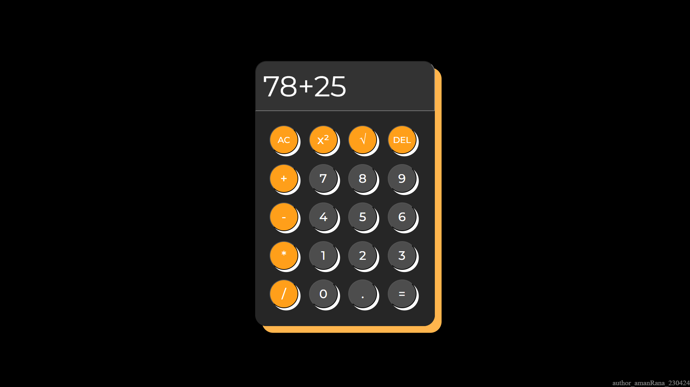

# Simple Calculator

A simple calculator built with HTML, CSS, and JavaScript that performs basic arithmetic operations.
  

## Features

- Addition, subtraction, multiplication, and division
- Square and square root operations
- User-friendly interface
- Responsive design
  

## Technologies Used

- HTML
- CSS
- JavaScript
  

## How to Use

1. Open the live demo link below in your web browser.
2. Enter the first number using the provided buttons.
3. Select the desired operator (addition, subtraction, multiplication, division, square, or square root).
4. Enter the second number (if applicable).
5. Click the equals (`=`) button to see the result.
6. You can clear the input using the `AC` button.
  

## Live Demo

You can view the live demo of the calculator at: [Live Demo](https://amanranahere.github.io/Calculator/)
  

## Screenshot

